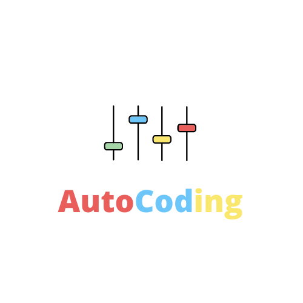

# AutoCoding
<p align="center" width="100%">
    
</p>  

    > Setup de projet pour C, C++, Java, Python

<p align="left" width="100%">
    
    by shift inc   
</p>  

# Utilisation
* Prerequis  
    * Avoir ou installer:  
        * [Python](https://www.python.org/ "telecharger python via ce lien") 
        * [mingw ](https://winlibs.com/ "telecharger mingw") pour la compilation
        * [Java](https://www.java.com/ "telecharger java")
        * [GNU Make](https://www.gnu.org/software/make/ "telecharger gnu make")      

    Ensuite Installer avec l’installateur de fichier fournir dans la rubrique compatibilité.
    Pour vérifier si l’installation ses bien passer, ouvrer votre Shell et exécuter :
    ```cmd
        ac.exe
    ```
    ou 
    ```cmd
        nac.exe
    ```
    Vous devriez voir un texte d'usage de commande.  
        Nb : certaine des commandes ne sont pas compatible avec certain des systèmes
    D’exploitation.

* Exemple
```cmd
    nac.exe auto c helloWorld 
```

> Créer un Project en C qui contient des répertoires et des fichiers prêts à être exécuter.

on auras une arborescence de dossier comme :  
```
* helloWrold/
    * src/ 
        * include/
        * main.c
    * Makefile
```
> [info] Le fichier *main.c* est déjà prêt à être compiler

```cmd
    nac.exe add c fonction 
```
> Créer un Project en C qui contient des répertoires et des fichiers prêts à être exécuter.

on auras une arborescence de dossier comme :
```
* helloWrold/
    * src/ 
        * include/
            * fonction.h
        * main.c
        * fonction.c
    * Makefile
```
> [info] Les fichiers *fonction.h* et *fonction.c* sont préremplir
# Compatibilité / télécharger
- [Windows 64bits](AutoCodingSetup1.0.exe)

    > compatibiliter linux et macos bientôt

<!-- - [Linux (Ubuntu 22.04, Debian)](C:/Users/yanna/hello/C/newAc/nac.exe)
- [MacOs](C:/Users/yanna/hello/C/newAc/nac.exe)  -->

# Les commandes

| commandes | Languages | arguments |
|-----:|-----------:|-----------:|
|  auto| *c , c++ , java, py, web,* | Nom du projet|
|   add| *c , c++ , java, py, web,*    | listes des fichiers à ajouter|
|   get| *c , cpp*       | nom de la bibliothèque |
|   setmodel| *web(html/css/js)*       | fichier |

# Contact / aide 

> GitHub -> [YxnnXriel](https://github.com/YxnnXriel)

ou  

Contacter moi par mail yannariel13@gmail.com pour avoir de l’aide, poser des questions ou contribuer au développement de ce petit projet. 
